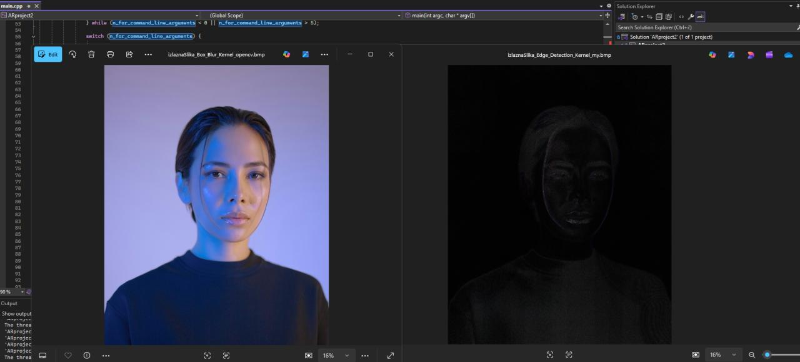

##  Optimization of Multimedia Content Processing Algorithm

Within this project task, the aim is to implement an optimized algorithm for processing multimedia content, focusing on either sound or image using the convolution operation. The implementation should adhere to the principles of object-oriented programming (OOP), SOLID principles, as well as principles of writing readable code and conventions of the used programming languages.

### Program Features:

- **Parallelizability**: The algorithm should be parallelizable to leverage the capabilities of multi-core processors for faster processing.
- **Configurability**: Users should have the ability to manually specify the convolutional kernel when running the algorithm.
- **Command Line Interface**: The program should accept paths to input and output files, as well as algorithm parameter values via the command-line argument.
- **Default Values**: Provide meaningful default values for all command-line arguments for user convenience.
- **Performance Optimization**: Implement algorithm optimization to achieve high performance, with a focus on efficient cache memory usage and the use of SIMD instructions for acceleration.

### Documentation and Performance Analysis:

- **Testing**: Validate the correctness of the algorithm through unit tests to ensure its functionality.
- **Performance Measurement**: Conduct runtime measurements of the algorithm for different input sizes and various input data scenarios.
- **Optimization**: Graphically represent measurement results before and after applying optimizations and parallelization.
- **Report**: Prepare a report containing a problem description, description of the basic algorithm, description of optimized algorithm variants, details of performance measurement, hardware used for measurements, graphical analysis of results, and conclusion.
- **Automation**: Include a script that automatically runs all measurements mentioned in the report and saves the results to a file for easier reproduction.

### Github Project Description:

This repository contains an implementation of an optimized algorithm for processing multimedia content, along with its accompanying report documenting the optimization process and performance analysis. The implementation is done following OOP principles and SOLID principles, using language-specific programming conventions. Additionally, a script for automated performance measurement of the algorithm and result storage is provided. Unit tests are included with the implementation to ensure algorithm correctness.

## Screenshots

> Convolution Example : BoxBlur-Kernel vs EdgeDetection-Kernel

---------------------------------------------------------------------------------------------------------------------------------------------------------------------------------------------------------
